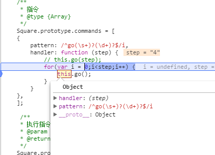

# 单刷百度前端技术学院2016任务

**开始时间**：`2016/12/17`

## 遇到的问题及其解决方法
###1. 任务十四

####1.1 遇到需要排序，复习了下几种基本排序算法
[JS版十大排序算法](http://blog.csdn.net/fengyinchao/article/details/52667625)<br>
[快速排序](http://www.ruanyifeng.com/blog/2011/04/quicksort_in_javascript.html)<br>
[快速排序（Quicksort）的Javascript实现](http://www.ruanyifeng.com/blog/2011/04/quicksort_in_javascript.html)<br>
看了网上的别人的解法，可以用array.filter、array.sort来实现大于60的筛选和排序，用array.forEach方法来代替for循环遍历处理数组元素。<br>

####1.2 对空气质量大于60筛选数据时，原始数据为如下：<br>
```
var aqiData = [
    ["北京", 90],
    ["上海", 50],
    ["福州", 80],
    ["广州", 85],
    ["成都", 95],
    ["西安", 100]
];
```

排序后发现<br>
返回的应该是一个二维数组，里面的元素都是一个数组。<br>
解决方法：
```
var temp=[];//声明一个临时数组
temp.push(arr[pivotIndex]);//用push方法把作为基准的城市数据暂存下来。
```

####1.3 动态添加li生成排行榜发现在循环在appendChild会导致回流。
```
var parentUl = document.getElementById('aqi-list');
var len = result.length;
for(i = 1;i<=result.length;i++){
　var li = document.createElement("li");
　　　li.innerHTML = "第"+i+"名是："+result[len-i];
　　　parentUl.appendChild(li);
}
```

可考虑将ul中内容 保存到临时字符串 最后一次性添加。<br>
解决如下： 
```
var parentUl = document.getElementById('aqi-list');
var contentStr = "";
var len = result.length;
for(i = 1;i<=result.length;i++){
    contentStr += "<li>第" + i + "名：" + result[len-i][0] + "，" + result[len-i][1] + "</li>";
}
parentUl.innerHTML = contentStr;

})();
```


[页面呈现流程 ](http://www.blogjava.net/BearRui/archive/2010/05/10/320502.html)

###2. 任务十六

####2.1 运行时发现can't set property onclick' of null。
解决方法把js文件放在`</body>`前执行
####2.2 绑定删除按钮删除事件，参考了[别人的代码](http://www.cnblogs.com/AfterStories/articles/5384051.html)，学习了[call()](https://developer.mozilla.org/zh-CN/docs/Web/JavaScript/Reference/Global_Objects/Function/call).

使用call()可以实现继承，新的对象可以继承另一个对象的方法而不用重写这个方法。

###3. 任务十七
####3.1 发现动态添加<option>的方法除了声明一个字符串，将option的内容使用innerHTML插入外，在《JavaScript高级程序设计》中发现
还可以使用add（）方法。
书中说，add（）接受两个参数：要添加的新选项和将位于新选项之后的选项。如果想在列表的最后添加一个选项，应该将第二个参数设置为null。在IE中，add（）第二个参数是可选的，兼容DOM的浏览器必须要求制定第二个参数。这时候，可以将第二个参数传入undefined。
innerHTML方法：
```
var cityStr = "";
for(var city in aqiSourceData){
    cityStr +="<option>"+ city +"</option>";
}
    document.getElementById('city-select').innerHTML = cityStr;
```
add()方法:
```
var city = document.getElementById('city-select');//获取<select>的id

for(var cityName in aqiSourceData){//遍历数据源aqiSourceData的key
    var newOption = new Option(cityName);
    city.add(newOption,undefined);
}
```

####3.2 事件委托
如果为fieldset中的每个input添加点击事件，循环遍历radio，为每个radio添加处理，增加交互就绪的时间。采用事件委托就是比较好的处理方式。适合用事件委托的事件：click、mousedown、mouseup、keydown、keyup、keypress。
好处：
1. 管理的函数变少了。不需要为每个元素都添加监听函数。对于同一个父节点下面类似的子元素，可以通过委托给父元素的监听函数来处理事件。
2. 以方便地动态添加和修改元素，不需要因为元素的改动而修改事件绑定。
3. JavaScript和DOM节点之间的关联变少了，这样也就减少了因循环引用而带来的内存泄漏发生的概率。

任务中只需为input的父层fieldset添加点击添加点击事件监听，判断是否点击input，点击则执行相应处理。

###4.任务十八

####4.1 delete 一个数组arr[i]，只能让原来的arr[i]的值为undefined，应该使用数组的splice方法。
[MDN关于Array的描述](https://developer.mozilla.org/zh-CN/docs/Web/JavaScript/Reference/Global_Objects/Array)
####4.2 实现“点击队列中任何一个元素，则该元素会被从队列中删除”需求时，一开始考虑的是判断点击的div里面的数字和队列中的哪个数字相等，如果相等则删除。忘记考虑了从多个数字相等的情况。应该获取点击的div在父元素中的索引，删除队列中对应的索引。
```
for()方法代码如下：
if(target && target.className === "numberList"){
//方法一：判断点击的div里面的数字与队列中的哪个数字相等，只适合数字都不同的时候
for(var i = 0; i<data.length;i++){
   if(data[i] == target.innerHTML){
   data.splice(i,1);
}
}
```
利用call来调用Array的原型方法indexOf()
```
var i = [].indexOf.call(target.parentNode.children, target);
data.splice(i,1);
renderChart(data);
```

###4.任务二十
####4.1 在textarea中按tab键会调到页面的下一个元素，而又想在textarea中按tab进行缩进。解决方法
是判断按下的键是否是tab键。
```
function inputKeyDown(e){
  if(e.keyCode == 9){
    e.preventDefault();
    var indent = '    ';
    var start = this.selectionStart;
    var end = this.selectionEnd;
    var selected = window.getSelection().toString();
    selected = indent + selected.replace(/\n/g,'\n'+indent);
    this.value = this.value.substring(0,start) + selected + this.value.substring(end);
    this.setSelectionRange(start+indent.length,start+selected.length);
}
}
```

###5. 任务二十一
####5.1 input标签没有hover属性

####5.2 当输入标签为input时，对input设置keydown事件监听，按回车会提交表单，如果按1，会判断按下的键值，但是不会将1放入input的value属性里，使得console.log(input的value属性)为空值。应改为监听input的onkeyup事件,同时判断当按下回车时，阻止input的默认行为。

####5.3 想把获取的数据插入元素的内容，
```
var str = "<div class=" + '"tagListTop"' + ">" + 123123 +"</div>";
wrapperTagsTop.innerHTML = str;
```
发现插入的是一个数组，原因在于通过getElementsByClassName返回的是一个数组，还要通过索引获取想要的节点。

####5.4 给div设置onmouseover事件监听鼠标移动到div时获取点击的是哪个节点，然后通过innerHTML改变其样式，代码如下
```
function divMouseOver(ele){
  var ele = ele|| window.event;
  var target = ele.target ||ev.srcElement;
  if(target && target.className == "tagListTop"){
      var i = [].indexOf.call(target.parentNode.children,target);
      wrapperTagsTop.children[i].innerHTML = "<div class=" + '"tagListTop"' + ">" +           "点击删除"+data[i] +"</div>";
}
}

function divMouseOut(){
  var ele = ele|| window.event;
  var target = ele.target ||ev.srcElement;
  if(target && target.className == "tagListTop"){
    var i = [].indexOf.call(target.parentNode.children,target);
    wrapperTagsTop.children[i].innerHTML = "<div class=" + '"tagListTop"' + ">" +data[i] +"</div>";
}
}
```

发现鼠标悬停和移出的效果如下：

<br>
原因：innerHTML实质是改变标签内的内容，即在该子节点div中间插入内容。
解决方法：在mouseover时插入"点击删除"和该爱好标签的内容，在mouseout时插入该爱好标签的内容。


####5.5 数组元素去重
一开始的思路是：
1. 声明一个新的数组用来存放结果；
2. for循环中每次从原数组中取出一个元素，用这个元素循环与结果数组对比；
3. 若结果数组中没有该元素，则存到结果数组中。
发现这种方法不够简练，改为
1. 声明一个新的数组用来存放结果
2. 声明一个空对象
3. for循环时，每次取出一个元素与对象进行对比，如果这个元素不重复，则把它存放到结果数组中，同时把这个元素的内容作为对象的一个属性，并赋值为1，存入到第2步建立的对象中。

review别人的代码发现对数组使用indexof方法，如果返回-1则不重复。代码更简练。

####5.6 本来想用正则表达式和test（）判断标签输入框如果有空格、回车、逗号按下时，输入框内的内容自动生成一个标签，但是发现这样有一个bug就是先按空格、回车、逗号，会马上生成一个标签内容为空格、回车、逗号，而需求是输入标签内容后按空格、回车、逗号才生成标签。
```
keyRegExp = /[,，、\s\n]/;
function inputTagsEvent(event){
  var inputData = inputTags.value;
  if(keyRegExp.match(inputData)[0] || getEvent(event).keyCode == 13){
    getEvent(event).preventDefault(event);//阻止回车默认事件
  if(validData(inputData.trim(),inputTags)){
    renderChart(tags,tagsListWrapper[0]);
    clearText(inputTags);
}
```

###6. 任务二十二

####6.1 实现前序遍历动画后点击其他遍历无法进行。
```
buildTree.prototype.animation = function(){
  var stack       = this.stack,
  speedSelect = document.querySelector('#speedSelect'),
  i           = 0,
  timer = 0;
  this.stack = [];

  console.log("1"+this);
  if(!this.isBuilding){
    this.isBuilding = true;
    console.log("2"+this);

    stack[i].style.backgroundColor = '#9da6bd';
    timer = setInterval(function(){
      if(i == stack.length-1){
        stack[i].style.backgroundColor = '#fff';
        this.isBuilding = false;
        console.log("3"+this);
        clearInterval(timer);
      }
      else{
        ++i;
        stack[i-1].style.backgroundColor = '#fff';
        stack[i].style.backgroundColor = '#9da6bd';
        console.log("every"+this);

      }
    },speedSelect.value);

  }
 };
 ```
 打印this后发现进入if判断后this对象从节点对象变为Window，因为在setInterval方法中this为Window
 <br>
 解决方法：
 在进入setInterval方法前，把this引用复制给一个变量，在setInterval中使用该变量引用节点对象。

###6. 任务二十四
####6.1 设置默认背景色
实现“点击某个节点元素，则该节点元素呈现一个特殊被选中的样式”需求时，对节点元素设置事件代理个，点击时改变其颜色为红色。发现点击一个节点后，里面的子节点颜色也变红。
```
    var event = event || window.event;
    var target = event.target || event.srcElement;
    if (target && target.tagName.toLowerCase() === "div") {
      target.style.backgroundColor = 'red';
    }
```
点击Shaq，里面的Shaq1、Shaq2、Shaq3、Shaq4背景颜色也变红。
<br>

打开控制台发现Shaq的样式
<br>

Shaq1、Shaq2、Shaq3、Shaq4的样式
<br>

原来是没有设置div的默认背景颜色为白色。只需在css中设置div的默认样式为白色即可。
在css中修改后，点击Shaq
<br>


####6.2 
删除子节点时，使用for循环从索引为0开始删除，发现不能删除完全部子节点，当删除索引为0的子节点后，原来索引为1的节点此时变成0了，而这时变量i已经变成1了，for继续运行时时就会删除原先索引为２的现在为1的节点删除。
解决办法是从索引最大值开始删除，采用递减的方法。
[Javascript removeChild()删除节点及删除子节点的方法](http://www.jb51.net/article/77042.htm);

####6.3 将wrapper下所有节点删除后发现在chrome下还有两个text空白节点，而且使用querySelector获取wrapper,使用wrpper.childNodes 返回的是一个NodeList，而 NodeList 不是数组，不能用数组方法。
```
var wrapper= document.querySelector('.wrapper'),
    NodeList = wrapper.childNodes,//返回的是NodeList！，NodeList不是数组，没有数组方法！
    regExp = /[^text,]+/,
    arr = Array.prototype.slice.call(NodeList)//将 NodeList 转换为 Array
```
-如果使用wrapper = document.getElementsByClassName('wrapper')，使用Object.prototype.toString.call判断wrapper，返回[object HTMLCollection].
-wrapper= document.querySelector('.wrapper')，使用Object.prototype.toString.call判断wrapper返回[object HTMLDivElement]。
-Node.childNodes返回的是[object NodeList]
-Node.children返回的是[object HTMLCollection]

删除wapper内所有节点后，看控制台可以发现
<br>
元素是一个小范围的定义，必须是含有完整信息的节点才是一个元素； 一个节点不一定是一个元素，而一个元素一定是一个节点。
[MDN关于NodeList的解释](https://developer.mozilla.org/zh-CN/docs/Web/API/NodeList)
[DOM树中的Node（节点）与Element（元素）的区别](http://blog.csdn.net/zgrjkflmkyc/article/details/43268933)


###7. 任务二十五
####7.1 js中静态方法
[js中静态方法（属性）、实例方法（属性）、内部方法（属性）和原型的一点见解](http://blog.csdn.net/panying0903/article/details/50246091)

#####7.2 查找祖节点
实现“按照内容进行节点查找，并且把找到的节点进行特殊样式呈现，如果找到的节点处于被父节点折叠隐藏的状态，则需要做对应的展开”需求时，一开始想到的是找到该节点node，找到该节点的父节点node.parentNode，然后展开，但是发现如果还有祖节点，那还需要把祖节点也展开。于是需要遍历该节点的所有祖节点。
```
//寻找祖节点
  var resultParent = [],
  x = node.children[i];
  while (x.getAttribute("id") != 'list') {
    resultParent.push(x);//把祖节点都入栈
    x = x.parentNode;
    }
    //对每个祖节点遍历,如果子节点是ul或li标签，则展开。
    resultParent.forEach(function(e){
    for(var j =0,ln = e.children.length;j<ln;j++){
    var tag =e.children[j].className.toLowerCase();
    if(tag != "toggle" && tag != "content" && tag !="add"&& tag != "delete"){
        e.children[j].style.display = "block";
    }
    else{
      if(tag == "toggle") {
        e.children[j].innerHTML = "v";
        }
    }
    }
});   
```

但是发现这样仍然存在不足，如果兄弟节点A、B都包含有需要查找的内容，如果找到A，再找到所有祖节点依次展开，到B的时候，还得再执行依次一样的流程，而这些祖节点在找到A后都已经展开了。

###7. 任务二十六
####7.1 当飞船飞行时，发现
<br>
原因:
```
/**
     * 画飞船
     * @param  {array} spaceships 飞船队列
     */
    var drawSpaceships = function(spaceship){
      var spaceshipImg = new Image(); //创建飞船贴图
            spaceshipImg.src = "img/min-iconfont-rocket-active.png";
            spaceshipImg.onload = function(){

              ctx.save(); //保存画布原有状态
              ctx.translate(SCREEN_CENTER_X, SCREEN_CENTER_Y); //将画布坐标原点移到画布中心
              ctx.rotate(-spaceship.deg * Math.PI / 180); //根据飞船飞行角度进行画布选择
              ctx.beginPath();
              if (spaceship.power > 60) {
                ctx.strokeStyle = POWERBAR_COLOR_GOOD;
              } else if (spaceship.power <= 60 && spaceship.power >= 20) {
                ctx.strokeStyle = POWERBAR_COLOR_MEDIUM;
              } else {
                ctx.strokeStyle = POWERBAR_COLOR_BAD;
              }
              ctx.lineWidth = POWERBAR_WIDTH;
              ctx.moveTo(spaceship.orbit, -POWERBAR_POS_OFFSET);
              ctx.lineTo(spaceship.orbit + SPACESHIP_SIZE * (spaceship.power / 100), -POWERBAR_POS_OFFSET);
                ctx.stroke();
                ctx.drawImage(spaceshipImg, spaceship.orbit, 0, SPACESHIP_SIZE, SPACESHIP_SIZE); //画飞船贴图
                ctx.restore(); //恢复画布到原有状态
            };

    };
```
画飞船的时候，没有把canvas清屏，每次都在原来的基础上继续画飞船。
在onload事件执行一开始开始添加
```
ctx.clearRect(0,0,SCREEN_WIDTH,SCREEN_HEIGHT); // clear canvas
                AminateUtil.drawPlanet();
                AminateUtil.drawOrbits();
``

####7.2image对象onload方法没有执行，没有显示图片。
再次刷新canvas（如销毁飞船，需要重绘时）由于图片加载缓冲区的速度太快，以至于没有运行到onload的时候，图片已经被加载完毕了。所以没有显示图片。
解决方法，利用image对象的complete属性,如：
```
var imgLoad = function (url) {
    var img = new Image();
    img.src = url;
    if (img.complete) {
        callback(img.width, img.height);
    } else {
        img.onload = function () {
            callback(img.width, img.height);
            img.onload = null;
        };
    };
};
```

####7.3使用requirejs对代码进行模块化优化
学习了requirejs，提高了代码的维护性。
-[require.js 入门学习](http://www.2cto.com/kf/201312/262057.html)
-[使用RequireJS优化Web应用前端](http://www.csdn.net/article/2012-09-27/2810404)
-[require.js 简洁入门](http://blog.sae.sina.com.cn/archives/4382)

####7.4 this和$(this)的区别
实际上$(this)=jquery()，所以$(this)获取的是jq对象

####7.5飞船销毁
飞船销毁时，如果一开始销毁1号，第二次销毁3号时，无法销毁。这是因为一开始我把每个飞船的id从0到3赋值，如果销毁1号（1号飞船在飞船队列的索引为1），那2号飞船在队列的索引自动变为1,3号为2，这样，执行
`spaceships.splice(obj.id,1)`时，无法删除3号，因为他一开始的索引为3。解决方法使用delete删除属性:
`delete spaceships[obj.id]`
-[MDN-delete](https://developer.mozilla.org/zh-CN/docs/Web/JavaScript/Reference/Operators/delete)


###8. 任务三十三
####8.1 如何获取表格的在某行某列上的单元格
`return table.rows[index].cells[index]`

###9. 任务三十四
####9.1 旋转div
原本想通过角度变化，旋转div实现向左向右方向改变,如向左：
`$(square.div).css("transform", "rotate(" -90 +"deg)");`
发现只能旋转一次，第二次再向左就无法旋转了。这是因为在rotate（）中的角度永远都是根据最初始的角度0度旋转，不是根据现在的角度。

###10. 任务三十五
####10.1 textarea光标定位在最后一行
<br>
想点击textarea时，光标定位在文本最后一行（第三行）。
获取textarea的文本内容，利用focus()将光标定位在文本最后一行。
```
var content=$.trim($('#command-list').val());  
$('#command-list').val("").focus().val(content); 
``` 
-[JQUERY实现点击INPUT使光标移动到最后或指定位置](https://www.xiariboke.com/design/2441.html)

####10.2 
实现删除命令后，左边指令行标同步。但是发现这样再按回车就无法新增一行。因为删除li和添加li冲突。按下回车，新增一行（此时这行的内容为空，做了忽略前后空白字符处理），代码中根据换行符匹配出指令的条数，忽略了空指令。此时指令条数和li数目不同，就会把新增的li删掉。只需不忽略指令前后空字符即可。
```
var editorBackSpace = function(event){
    var content=$('#command-list').val();
    var liNum = $('#command-number').get(0).children.length;
    var entnterNum = content.split(/\n/g).length;
    if(liNum != entnterNum) {
      $('li').last().remove();
    }
  };

```
####10.3 滚动右边指令时，左边指令行数同步滚动。
-<br>
```$commandNumber.scrollTop($commandList.get(0).scrollTop).get(0);```

####10.4 jquery click()、keydown()中如何传递参数
想在keydwons()事件中把editor对象当参数传进去
```
var Editor = function(x,y) {
    var instance;
    if(typeof instance === 'object' ) {
      return instance;
    }
    instance = this;
    this.$commandNumber = $('#command-number');// 指令行数列表
    this.$commandList = $('#command-list');//指令列表
    //this.$commandList.keydown({object: this},this.inputKeyDown);
    this.$commandList.keydown(this,this.inputKeyDown);//this为editor对象当参数传进去
    this.$commandList.focus(this.editorFocus());
    this.$commandList.scroll(this.editorScroll);
    this.$commandList.on('input propertychange',this.inputBackSpace);
  };

``
但是在
```
Editor.prototype.inputKeyDown = function(event) {
    // var e = event || window.event;
    // if(e.keyCode == 13) {
    //  $('#command-number').append("<li></li>");
    // }
    console.log(this);
    
  };
```
this是当前执行inputKeyDown的控件。查了资料，发现在
`jQueryObject.click([[data,]handler])`中data是个jason对象。
解决方法：
声明一个对象`var object = {object:this};`
在`this.$commandList.keydown(object,this.inputKeyDown);`中传进去。
-[JQuery中如何传递参数如click(),change()等具体实现](http://www.jb51.net/article/36249.htm)

####10.5 for循环里使用setTimeout()
```
//执行指令
if(!commandError) {
      var pre = 0;
      for(var j = 0,l = commands.length;j<l;j++){
        if(commands[j]){
          setTimeout(function(){
            _self.square.execute(_self.square,commands[j]);
            _self.editor.clearFlag(pre,"");
            _self.editor.setFlag(j,"success");
            pre = j;
          },TIME);
        }
      }
    }
```
想每隔1s执行依次执行命令，但是发现这样写1s后才开始执行setTimeout里面的方法，而此时j已经为undefined。
setTimeout和setInterval的运行机制是，将指定的代码移出本次执行，等到下一轮Event Loop时，再检查是否到了指定时间。如果到了，就执行对应的代码；如果不到，就等到再下一轮Event Loop时重新判断。这意味着，setTimeout指定的代码，必须等到本次执行的所有代码都执行完，才会执行。
所以setTimeout的真正作用是，在“任务队列”的现有事件的后面再添加一个事件，规定在指定时间执行某段代码。setTimeout添加的事件，会在下一次Event Loop执行。
解决方法，使用闭包:
```
//依次运行命令
    if(!commandError) {
      var pre = 0;
      for (var j = 0,l = commands.length;j<l;j++) {
        if(commands[j]){
          (function(j){
            setTimeout( function timer(){
              _self.square.execute(_self.square,commands[j]);
              _self.editor.clearFlag(pre,"");
              _self.editor.setFlag(j,"success");
              pre = j;
            }, 1000 *j);//乘以j因为是指从开始进入队列开始等待的时间，1s、2s...即每隔1s执行。
          })(j);
        }
      }
    }
```
-[关于setTimeout()你所不知道的地方](http://caibaojian.com/about-settimeout.html)<br>
-[js for里面setTimeout问题]()<br>

####10.6 使用apply()、call()、bind()传递this
依次执行执行的时候
```
 Square.prototype.execute = function(string) {
        // var that = square;
        if(!this.isRunning){
            this.isRunning = true;
            for(var i = 0,len = this.commands.length;i<len;i++) {
                var command = this.commands[i];
                var match = string.match(command.pattern);
                if(match){
                    console.log(this);
                    command.handler(match[2]);
                    //command.handler.apply(this,[match[2]]);
                    match.shift();
                    //this.isRunSucceed = true;
                    this.isRunning = false;
            }
            }

        }
    };
```
这里的this是Square对象
<br>
在指令中，this对象却变成了commands数组对象
<br>
因为我没有指定comands中的this为Square,this变成运行时候的对象即commands数组。
```
 /**
     * 指令
     * @type {Array}
     */
    Square.prototype.commands = [
    {
        pattern: /^go(\s+)?(\d+)?$/i,
        handler: function (step) {
            // this.go(step);
            for(var i = 0;i<step;i++) {
                this.go();
            }
        }
    },
    ];
```
解决:`command.handler.apply(this,[match[2]]);`把Square对象当参数传进去。
[js中bind、call、apply函数的用法](http://rangercyh.blog.51cto.com/1444712/1615809);

####10.7 块级作用域
js没有块级作用域。
```
if(true){
  var color = "red";
}
alert(color);//red
```
如果在c、java、c++中，color会在if语句执行完毕后销毁。在js中，if中的变量声明会将变量添加到当前执行环境中。在使用for语句时要牢记这一点。

####10.8 在点击运行时，在点击运行，小方块执行了两次全部指令
原因还是同10.5中所说。setTimeout在“任务队列”的现有事件的后面再添加一个事件，规定在指定时间执行某段代码。第一次点击，判断编辑器是否在运行的变量_self.editor.isRunning已经在setTimeout的指定时间内运行完变成false，所以可以再点击运行按钮重复运行指令。
解决方法，把原本在一开始执行指令后使```_self.editor.isRunning = ture```放在setTimeout方法里面。

####10.9 指令执行时间
当有空指令时，虽然没有执行指令，但是也等待了一段时间才执行有效指令。而我想要的是跳过空指令的等待时间，直接执行有效指令。
<br>
这里等待了3秒后才执行go，应该是等待1s执行go。
解决方法：
1、先筛选有效指令的索引
```
var validComandsIndex = [];
          //筛选出有效指令
          for(i =0;i<len;i++){
            if(commands[i]){
              validComandsIndex.push(i);
            }
          }
```
2、再执行有效指令
```
for(var k=0,ln = validComandsIndex.length;k<ln;k++){
            (function(){
              var j = k;
              _self.square.isRunSucceed = false;
              setTimeout(function(){
                  _self.editor.isRunning = true;
                  pre = validComandsIndex[j];
                  _self.editor.clearFlag();
                  _self.square.execute(commands[validComandsIndex[j]]);
                  if(_self.square.isRunSucceed){
                    _self.editor.setFlag(validComandsIndex[j],"success");
                  }
                  else{
                    _self.editor.setFlag(validComandsIndex[j],"warnning");
                    _self.editor.setErrorText(j,"warnningText");
                    _self.editor.isRunning = false;
                    return true;
                  }
                },j*TIME);
            })(k);
          }
```

####10.10 中断setTimeout
当小方块前面有墙时，应该不能执行下一步指令。我在setTimeout中设置了return 中止。但是发现这样不行。
<br>
```
else{
    _self.editor.setFlag(validComandsIndex[j],"warnning");
    _self.editor.setErrorText(j,"warnningText");
    _self.editor.isRunning = false;
    return true;
    }
```